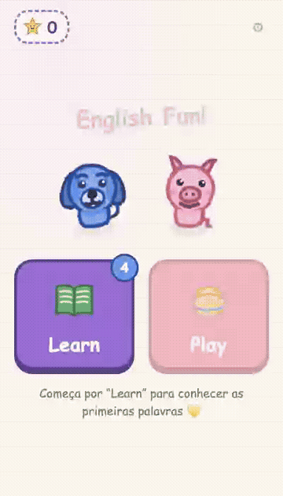
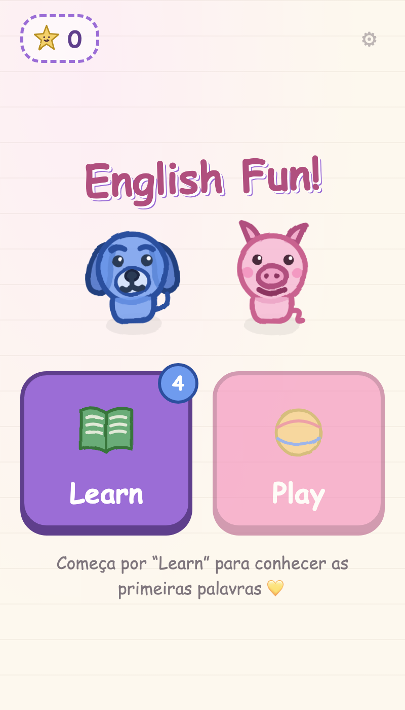
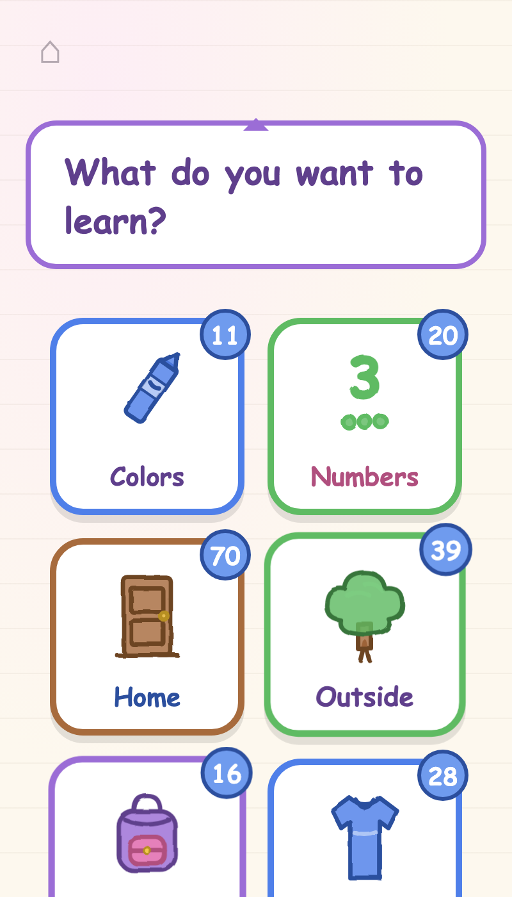
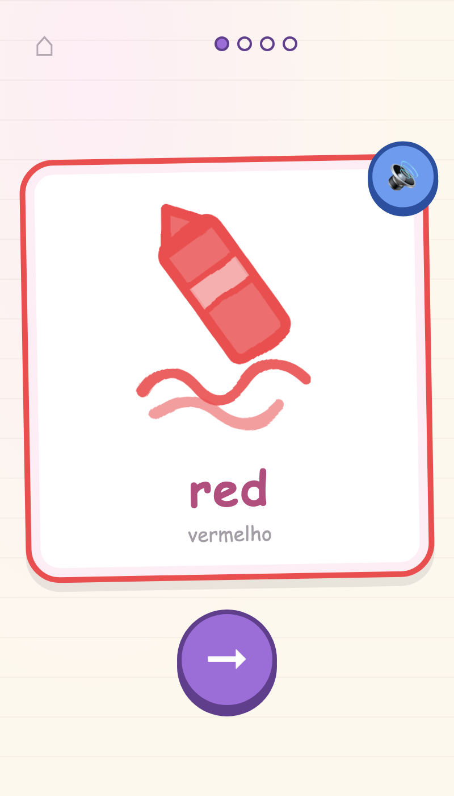
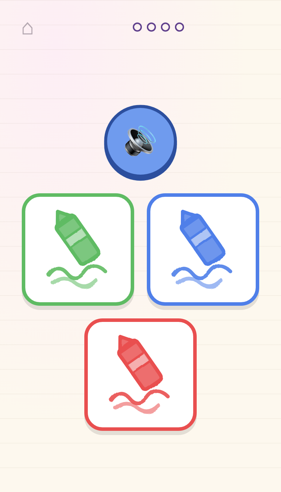

# English Fun! 🖍️

A vocabulary game that teaches English to young kids (ages 5-9) through
pictures, sound and play — with spaced repetition (Anki-style) quietly
doing the heavy lifting underneath.

<p align="center">
  
</p>

**▶ Play it:** [masterviana.github.io/english-with-fun](https://masterviana.github.io/english-with-fun/)

## Screenshots

| Home | World map | Learn | Play |
|:---:|:---:|:---:|:---:|
|  |  |  |  |

## What's inside

- **184 words** across 13 themes, organised as explorable worlds:
  Colors, Numbers 1-20, 🏠 Home (bedroom, kitchen, living room,
  bathroom, food), 🌳 Outside (park, car, beach), 👤 Me (body, clothes)
  and 🎒 School.
- **Hand-drawn SVG art** in a crayon-on-paper style, one illustration
  per word, with card borders matching each drawing's dominant colour.
- **Real voice** for every word (child-friendly TTS, slowed down and
  padded so little ears catch every sound), with Web Speech fallback.
- **Learn** — the child picks a theme and meets up to 4 new words:
  big card, picture, word and voice. Tap to hear it again.
- **Play** — listen and tap the right picture. Correct answers feed the
  spaced-repetition engine; mistakes are never punished ("Almost!
  Listen again"), and stars rain down at the end.
- **Progress-based unlocking** — new words open up only when reviews
  are done and recent words are mastered. No clocks, no daily nagging:
  the child sets the pace by playing well.
- **Made for tablets** — add it to the home screen and it runs
  full-screen like an app (PWA), fully offline-friendly and 100% static.
- **Parents' panel** — long-press the ⚙ gear: per-word levels, theme
  switch and reset.

## How the spaced repetition works

Every word has a level from 0 to 5. Answering right on the first tap
moves it up and schedules the next review further away (1, 2, 4, 7, 14
days); missing brings it back sooner. New words unlock only while there
are no pending reviews and fewer than 4 "weak" words — so learning
always stands on solid ground. The child never self-grades; the quiz is
the grader, and it only ever celebrates.

## Development

```bash
npm install
npm run dev        # http://localhost:3000/english-with-fun/
npm test           # spaced-repetition engine tests
npm run check      # content validator (packs, art, audio coverage)
npm run generate   # static build in .output/public
```

## Adding content

Vocabulary lives in `data/packs/*.json` (one file per theme), worlds in
`data/grupos.json`, and all artwork in `app/utils/art.mjs`. The full
recipe (schema, art style contract, preview tooling, validation) is in
[`AGENTS.md`](AGENTS.md). Preview any drawing with
`node scripts/preview_art.mjs <id>`.

Voices are generated once with [edge-tts](https://github.com/rany2/edge-tts):

```bash
pip install edge-tts
python3 scripts/gerar_audio.py
```

## Deploy

Every push to `main` runs GitHub Actions: content check → tests →
`nuxt generate` → GitHub Pages. Nothing to run manually.
